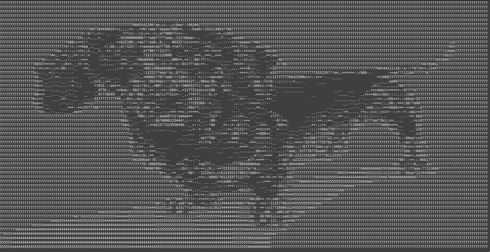

# Go-image-to-ascii

Convert a bitmap image into ASCII.

## Features

- works with webcam in realtime
- reads png, jpeg and webp images




## Build

```make windows```

```make linux```

## Usage

The source image will be stretched to fit the actual size in characters of the active terminal.

### Webcam

```./bin/go-image-to-ascii-linux -webcam```

### Static image

```./bin/go-image-to-ascii-linux -file image.webp```
